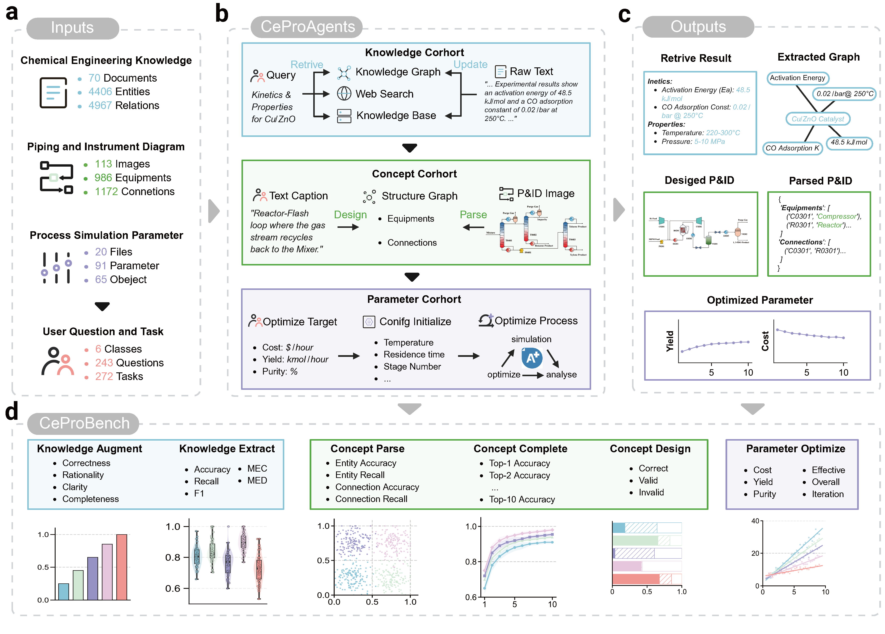

# CeProAgents

[](LICENSE)
[](https://www.python.org/)
[](https://www.aspentech.com/)
[](TODO)

This repository contains the official implementation and benchmark for **CeProAgents** and **CeProBench**.

* [📖 Introduction](#-introduction)
* [🛠️ Environment Setup](#️-environment-setup)
* [📂 CeProBench Preparation](#-ceprobench-preparation)
* [🚀 CeProAgents Usage](#-ceproagents-usage)
* [🏃 Scripts Evaluation](#-scripts-evaluation)
* [🔗 Citation](#-citation)
* [✉️ Contact](#️-contact)
## 📖 Introduction

CeProAgents represents a paradigm shift in automated chemical engineering, establishing a hierarchical and cooperative multi-agent framework designed to master the holistic complexity of process development, from molecular discovery to industrial-scale amplification. Recognizing that monolithic Large Language Models often struggle with the strict physical constraints, specialized depth, and long-horizon reasoning required in this domain, our system mirrors the collaborative structure of human engineering teams through three specialized cohorts. The Knowledge Cohort builds a rigorous epistemic foundation by synthesizing data from web searches, internal RAG pipelines, and structured Knowledge Graphs to mitigate hallucination; the Concept Cohort leverages multimodal reasoning to digitize, complete, and generatively design valid Process Flow Diagrams (P&IDs); and the Parameter Cohort drives closed-loop simulations via industry-standard engines to autonomously optimize yield, purity, and cost. Complementing this architecture, we introduce CeProBench, a multi-dimensional benchmark suite designed to rigorously evaluate agentic capabilities across knowledge extraction, topological reasoning, and high-dimensional parameter optimization.



## 🛠️ Environment Setup

We recommend using Miniconda or Anaconda to manage the Python environment.

### 1. Create the environment
```bash
conda create -n ceproagents python=3.10 -y
conda activate ceproagents
```

### 2. Install dependencies

```bash
pip install -r requirements.txt
```

### 3. Aspen Configuration

[Aspen Plus (V10+)](https://www.aspentech.com/en/products/engineering/aspen-plus): Required for the Parameter Cohort. Ensure the Windows COM interface is active.

### 4. LLM Configuration

Configure your LLM backbones in `configs/llm_config.py` or export them as environment variables.

```bash
export OPENAI_API_KEY="your_key_here"
export GOOGLE_API_KEY="your_key_here"
export ANTHROPIC_API_KEY="your_key_here"
export DEEPSEEK_API_KEY="your_key_here"
export QWEN_API_KEY="your_key_here"
```

## 📂 CeProBench Preparation

The **CeProBench** dataset is organized into three dimensions corresponding to the three agent cohorts. Organize the data in the `CeProBench/` directory:

```text
CeProBench/
├── knowledge/
├── concept/
└── parameter/
```

You can download the curated CeProBench dataset from this [link](https://drive.google.com/drive/folders/1YYrjKN2wQRA-zY0pJOLKO8oX1ZfspoWB?usp=sharing).

## 🚀 CeProAgents Usage
We provide a comprehensive Jupyter Notebook `CeProAgents_usage.ipynb` to demonstrate the detailed usage of CeProAgents. This single notebook includes step-by-step guides for:

* Knowledge Cohort: Running Knowledge Extraction from technical PDFs and executing Multi-Agent QA.
* Concept Cohort: Performing P&ID Parsing, Topology Completion, and Generative Design tasks.
* Parameter Cohort: Setting up and running Closed-loop Simulation Optimization (requires Aspen Plus).

## 🏃 Scripts Evaluation

To facilitate reproducible evaluation, we provide a comprehensive set of execution (`run_*.py`) and metric calculation (`eval_*.py`) scripts within the `CeProBench` directory.

### 1. Script Structure

Ensure your `CeProBench/` directory contains the following specialized scripts for each cohort:

```text
CeProBench/
├── run_knowledge_extract.py  # [Knowledge] Run Extraction
├── eval_knowledge_extract.py # [Knowledge] Evaluate Extraction
├── run_knowledge_augment.py  # [Knowledge] Run Augment 
├── eval_knowledge_augment.py # [Knowledge] Evaluate Augment
│
├── run_concept_parse.py      # [Concept] Run Parsing
├── eval_concept_parse.py     # [Concept] Evaluate Parsing
├── run_concept_complete.py   # [Concept] Run Completion
├── eval_concept_complete.py  # [Concept] Evaluate Completion
├── run_concept_generate.py   # [Concept] Run Design
├── eval_concept_generate.py  # [Concept] Evaluate Design
│
├── run_parameter_optimize.py # [Parameter] Run Optimization
└── eval_parameter_optimize.py# [Parameter] Evaluate Optimization
```

### 2. Run Task

Execute the task using the `run_*.py` scripts.

```Bash
python CeProBench/run_<dimension>_<task>.py -<arguments>
```

### 3. Evaluation Task

Calculate evaluation metrics using the `eval_*.py` scripts.

```Bash
python CeProBench/eval_<dimension>_<task>.py -<arguments>
```

## 🔗 Citation

If you find CeProAgents or CeProBench useful in your research, please cite our paper:

```bibtex
@article{yang2026ceproagents,
  title={CeProAgents: A Hierarchical Agents System for Automated Chemical Process Development},
  author={Yang, Yuhang and Li, Ruikang and Zhang, Kai and Ma, Jifei and Bu, Yonggan and Liu, Qi and Zhou, Jibin and Chen, Enhong},
  journal={TODO},
  year={2026}
}
```

## ✉️ Contact
If you have any questions or encounter issues, please feel free to:
* Open an issue in this repository.
* Contact the authors via email: [liruikang@mail.ustc.edu.cn](mailto:liruikang@mail.ustc.edu.cn).
